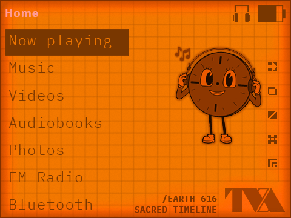

# TVA TamPad Classic Theme for Innioasis Y1

This repository contains a series of themes for the Innioasis Y1 music player, themed after the TVA device from the Marvel Universe, the TamPad. Inspired by the Loki series.

## 🎨 Theme Description

**UNIDENTIFIED OBJECT DETECTED:** this file shouldn't have existed in your timeline. It came into your possession by accident—perhaps dropped in a rush by a UVI agent or intercepted during an attempted reality erasure. Your Innioasis Y1 player has now become an illegally modified TemPad. You are no longer just a listener. You are a Variant, possessing the technology of the Gods.

**Amber Monochrome Interface:**
A deep dive into the O.B.’s archives. The warm amber glow of a CRT monitor mimics the terminals found in the darkest corners of the TVA. High contrast and a vintage raster effect turn your screen into a piece of equipment that has survived eons. It’s the perfect mode for those late-night sessions when you’re digging through the sounds of forgotten realities.**

**The Miss Minutes Protocol:**
You’re not navigating this timeline alone. The interface features Miss Minutes—the TVA’s quirky yet formidable AI guide. Her iconic clock-face avatar is integrated into the system, keeping a watchful eye on your playback. She might look like a friendly cartoon, but remember: she knows everything you listen to. Don't let her smile fool you—she's there to ensure your musical choices don't fracture the Sacred Timeline... or perhaps she's helping you break it.

**Loki Classic Interface:**
This is the standard operating layout of the device you "borrowed" from the Office employee. Warm orange tones and clean 70s lines create the illusion of official equipment, and each music folder now looks like a dossier on an entire era. Scroll through tracks as if selecting coordinates for a space jump.

The theme is maximally detailed based on all available information from official resources and the r/innioasis community.

Available color schemes: **Classic** and **Amber monochrome(this)**.  

## 🖼️ Screenshots

## 🎨 Custom

**Personalize your TVA TamPad!** You can easily change wallpapers and fonts:

### Current settings in `config.json`:
"desktopWallpaper": "desk-2.png",
"globalWallpaper": "globalWallpaper-1.png"

### Wallpaper variants (replace `1` with `0` or `2`):
| Variant | desktopWallpaper | globalWallpaper | Effect |
|---------|------------------|-----------------|---------|
| **0** | `desk-0.png` | `globalWallpaper-0.png` | No screen color effect |
| **1**  | `desk-1.png` | `globalWallpaper-1.png` | Classic screen color effect |
| **2** *(default)*| `desk-2.png` | `globalWallpaper-2.png` | Classic screen color effect with "Earth-616" |

### Fonts
By default, the themes use IBMPlexMono-Light.ttf (configured in config.json). However, the theme folder includes alternative weights if you want to tweak the interface density:
IBMPlexMono-ExtraLight.ttf — for a sleek, thin "high-tech terminal" look.
IBMPlexMono-Medium.ttf — for bolder text and better readability in high-glare conditions.
How to change: Open your config.json in any text editor and replace the default font filename with your preferred one from the list.

### Current font in `config.json`:
"fontFamily": "IBMPlexMonoLight.ttf"

## ⚖️ Font License & Attribution
The IBM Plex Mono font family is the intellectual property of IBM Corp.
License: SIL Open Font License, Version 1.1.
These are open-source fonts, used here in accordance with the OFL terms for non-commercial distribution.

## ⚠️ Known Limitations

These interface elements cannot be customized (undocumented parameters):  
- 🔊 status bar icons: vibration and click sound when pressing buttons;  
- 📅 calendar icon with number 7 in "Date & Time" settings.  

I'd be very grateful for any information on how to customize these elements!

## 🌐 Links

- [Arthur_Moss - Reddit profile](https://www.reddit.com/user/Arthur_Moss/)
- [r/innioasis community](https://www.reddit.com/r/innioasis/)

## 📜 Disclaimer

**Loki, TVA, TemPad** and all related elements belong to Marvel Studios and their rightful owners. This is non-commercial fan art created out of love for the Loki series and the MCU. These themes for the Innioasis Y1 are designed to transform your device into a tribute to the TVA’s retro-futuristic aesthetic.

🎮 Huge thanks to Marvel Studios and the creators of "Loki" for the incredible inspiration!

## 📋 [RUS] Quick Overview

**TVA TamPad Classic тема** для плеера Innioasis Y1.

Превратите свой плеер Innioasis Y1 в нелегально модифицированный TemPad из управления TVA. Этот проект — дань уважения эстетике сериала «Локи» и ретро-футуризму 70-х.
**Loki Classic:**аутентичный интерфейс полевого агента в теплых оранжевых тонах. Каждая папка — это досье на новую эпоху.
**Amber Monochrome:** режим архивного терминала с мягким янтарным свечением ЭЛТ-монитора для глубокого погружения в звук.
**Miss Minutes Protocol:** ваша музыка под присмотром ИИ-помощника. Мисс Минутка уже в системе — следит, чтобы ваш плейлист не разрушил Священную хронологию.

Музыка — ваш портал в другие измерения. Помните: вы теперь Вариант, и таймлайн в ваших руках.

✅ Максимальная детализация интерфейса с образами персонажа - Мисс Минутка 
❌ Ограничения: статус-бар (вибрация/щелчки), календарь в настройках  
🙏 Ищу помощь по недостающим параметрам  
© Фанатское творчество. Все права на франшизу «Локи», TVA и дизайн TemPad принадлежат Marvel Studios.

# How to Update or Edit This Theme

## For Beginners

You can edit this theme even if you've never used GitHub before.

### Quick Start

**Just upload your theme folder**

At minimum, you can upload a theme folder with images and it will appear on the website. However, it's better to include a config.json file with your theme information.

### Updating This Theme

1. Go to github.com/y1-community/InnioasisY1Themes
2. Click "Fork" (makes your own copy)
3. Navigate to this theme's folder in your fork
4. Click "Add file" → "Upload files"
5. Drag and drop your updated files (or entire folder) into the upload area
   - You can upload individual files or replace the entire folder
   - GitHub will show which files are new, changed, or deleted
6. Scroll down and click "Commit changes"
7. Click "Contribute" → "Open pull request" to submit your changes

**Note:** You can also edit individual files by clicking them and using the pencil icon, but uploading files is easier when you have multiple changes or new images.

### What is config.json?

This file contains your theme's name, author, description, and colors. You can create one by copying the structure from another theme's config.json file.

### Give Your Theme Its Own Page

This theme uses an `index.html` template that automatically displays your theme's information, screenshots, and assets. To give your new theme its own page on **themes.innioasis.app**:

1. **Copy `index.html`** from one theme's folder (like this one) to your new theme's folder, OR
2. **Download the template** from [themes.innioasis.app/yourTheme](https://themes.innioasis.app/yourTheme/) and place it in your theme folder

When you upload your theme folder to the repository, it will automatically get its own page at `themes.innioasis.app/YourThemeName`. The `index.html` file reads from your `config.json` to display theme information automatically.

---

## For Advanced Users

Theme information priority: config.json (in theme folder) > themes.json (root) > folder name.

Each theme gets a URL: https://themes.innioasis.app/[ThemeFolderName]

An index.html file is required for the URL to work. The index.html automatically loads from config.json, so you don't need to edit it manually.

File naming: cover.png (cover image), screenshot.png (screenshots), 1.png (selected background), 2.png (right arrow). Suffixed variants like 1_YS.png take priority over 1.png.

---

## Installation

**Direct Install:** Connect Y1 via USB, visit theme page, click "Install on Y1", select Themes folder.

**ZIP Download:** Download ZIP, extract, copy to Y1's Themes directory.

**Innioasis Updater:** Use Toolkit section, drag theme ZIP, connect Y1.

After installation, restart Y1 and select theme from Settings.

